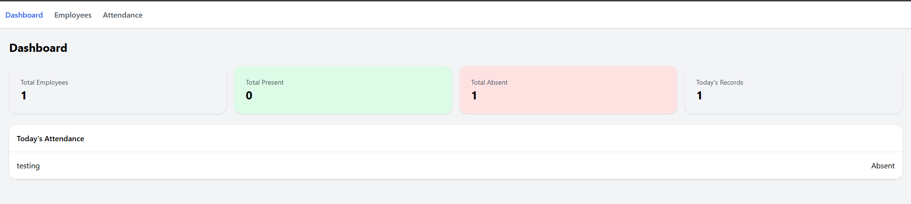
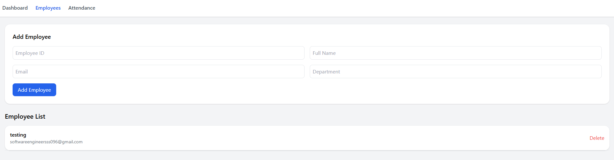
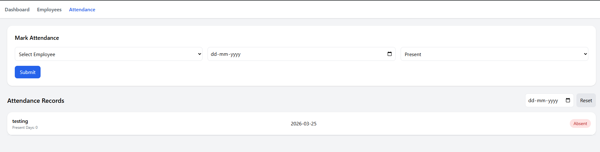

# 🚀 HRMS Lite – Full Stack Application

A lightweight Human Resource Management System (HRMS Lite) built using React and Django to manage employees and track attendance.

---

## 🌐 Live Demo

- 🔗 Frontend: https://hrms-lite-eta-nine.vercel.app/ 
- 🔗 Backend API: https://vijay286.pythonanywhere.com/api/

---

## 📌 Project Overview

HRMS Lite is a simple web-based internal tool designed for administrators to:

- Manage employee records
- Track daily attendance
- View attendance analytics via dashboard

The application focuses on clean UI, proper backend validation, and production-ready structure.

---

## 🛠 Tech Stack

### 🔹 Frontend
- React (Vite)
- Tailwind CSS
- React Router DOM
- Axios
- React Hot Toast

### 🔹 Backend
- Django
- Django REST Framework

### 🔹 Database
- SQLite

### 🔹 Deployment
- Frontend: Vercel
- Backend: Render

---

## ✨ Features

### 👨‍💼 Employee Management
- Add employee (ID, Name, Email, Department)
- View all employees
- Delete employee
- Unique employee validation

---

### 📅 Attendance Management
- Mark attendance (Present / Absent)
- Prevent duplicate attendance (same employee + date)
- Restrict future dates
- View attendance records
- Filter attendance by date

---

### 📊 Dashboard Analytics
- Total employees
- Total present / absent records
- Today’s attendance summary
- Attendance list for current date

---

### 📈 Additional Enhancements
- Display total present days per employee
- Active navigation highlighting
- Loading states & empty states
- Toast notifications for actions

---

## ⚙️ API Endpoints

### Employees
- `GET /api/employees/`
- `POST /api/employees/`
- `DELETE /api/employees/{id}/`

### Attendance
- `GET /api/attendance/`
- `POST /api/attendance/`

---

## 🚀 Run Locally

### 1️⃣ Clone Repository

```bash
git clone https://github.com/Prajapati-vijay/hrms-lite.git
cd hrms-lite
```
### 2️⃣ Backend Setup

```bash
cd hrms_backend

python -m venv env
env\Scripts\activate   # Windows

pip install -r requirements.txt
python manage.py migrate
python manage.py runserver
```
### 3️⃣ Frontend Setup

```bash
cd hrms-frontend
npm install
npm run dev
```

### ⚠️ Assumptions & Limitations
Single admin user (no authentication)
SQLite used for simplicity (not production-grade DB)
No pagination implemented
No edit/update functionality for records

### 💡 Future Improvements
Authentication (Admin login)
Role-based access control
Edit/update employee & attendance
Advanced filtering (by employee/date range)
Pagination & search
Charts & graphs in dashboard

### 🧠 Design Decisions
Monorepo structure for easier management
Backend validation for data integrity
Tailwind CSS for rapid UI development
Axios-based centralized API handling
Clean separation of components & pages


### 📌 Notes
Ensure backend is running before frontend during local setup
Update API base URL in frontend for production
CORS enabled for frontend-backend communication

## 📸 Screenshots
### Dashboard


### Employees


### Attendance


### 👨‍💻 Author
Vijay Prajapati | Senior Software Engineer | Full stack developer
